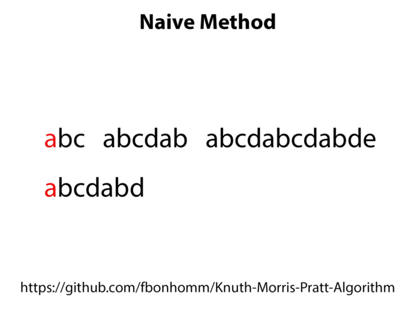
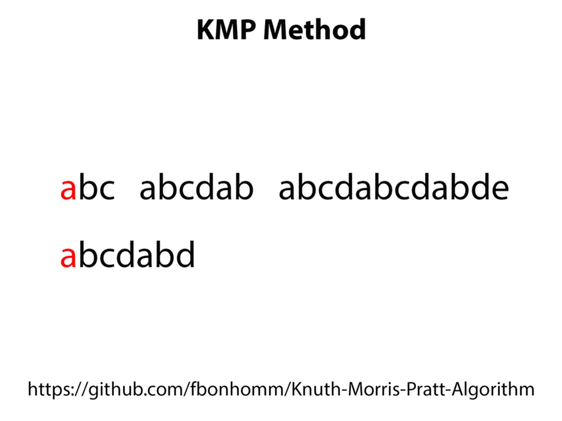

[L'algorithme de Knuth-Morris-Pratt](https://fr.wikipedia.org/wiki/Algorithme_de_Knuth-Morris-Pratt) est un algorithme de [recherche de sous-chaîne](https://fr.wikipedia.org/wiki/Algorithme_de_recherche_de_sous-cha%C3%AEne).

Il fait un pré-traitement sur la sous-chaîne en créant un tableau avec les sauts à faire pour éviter de la recherche inutile.

L'algorithme se découpe en 2 parties, une phase de construction du tableau de saut et une phase de recherche.

## Construction de la table de saut [[Code table](../kmp/table.go)]
Pour "participate in parachute" (24), la table est "-1 0 0 0 0 0 0 -1 0 2 0 0 0 0 0 -1 0 0 3 0 0 0 0 0 0 (25)"

La première lettre est "p", donc a chaque "p", on inscrit -1 dans la table.

La seconde lettre est "a", donc a chaque "pa", on inscrit -1 0 dans la table, soit la taille du pattern.

La troisième lettre est "r", donc a chaque "par", on inscrit -1 0 0 dans la table, soit la taille du pattern.

...

On met `0` pour chaque combinaison finis par la longueur ou la première combinaison comme:
* `-1 0 0 0 0 0 0 -1` == `particip` (première combinaison `partici`)
* `-1 0 0 0 0 0 0 -1 0 2` == `participat` (le `2` signifie les 2 avant le `t`)

Pour `par` on inscrit `-1 0 0`, si le suivant est `t` alors `-1 0 0 0` sinon `-1 0 0 3` (à part le début bien sûr)

Alors:
* `-1 0 0 0 0 0 0` == `partici`
* `-1 0 2` == `pat`
* `0 0 0 0 0` == `e in `
* `-1 0 0 3` == `para`
* `0 0 0 0 0` == `chute`
* `0` le dernier caractère sert un inscrit une combinaison si y'en a une à la fin, donc le tableau fait la taille de la chaine + 1

## Recherche de la sous-chaine [[Code recherche](../kmp/searchFirstOccurrence.go)]
La recherche est très simple, quand c'est égal à l'incrément l'index de la chaine et l'index de la sous-chaîne.

Quand ce n'est pas égal, on récupère la valeur du tableau avec l'index de la sous-chaîne, cette valeur devient l'index de la sous-chaîne.

Si l'index de la sous-chaîne est `-1`, on incrémente les 2 indexent sinon on ne fait rien.

Avec la méthode naïve, on est à 39 étapes.

Avec la méthode KMP, on est à 26 étapes.
